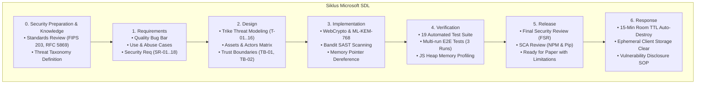
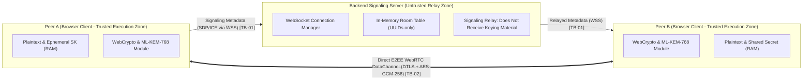

# Inventaris Diagram & Ilustrasi SSDLC (Figures Inventory) — Kiw Kiw Chat

Direktori ini memuat seluruh diagram arsitektural, alur protokol kriptografi, batasan kepercayaan (*Trust Boundaries*), dan diagram alir metodologi SSDLC yang siap digunakan untuk penulisan artikel ilmiah / paper.

---

## 1. Daftar Gambar & Diagram untuk Paper

### Gambar 1: Alur Metodologi Microsoft SDL & Integrasi Trike Threat Modeling
Diagram ini mengilustrasikan fase inti Microsoft SDL dengan penekanan pada integrasi Trike Threat Modeling pada tahap *Requirements* dan *Design*.



---

### Gambar 2: Batasan Kepercayaan (Trust Boundaries) & Signaling Relay
Diagram ini memperlihatkan pemisahan tegas antara zona browser tepercaya (*Trusted Execution Zone*) dan jaringan perantara backend (*Untrusted Relay Zone*).



---

### Gambar 3: Protokol PSK-Assisted ML-KEM Session-Key Establishment (ML-KEM-768 + HKDF + HMAC)
Diagram sekuensial yang merinci pertukaran 3-fase: `pq-pubkey`, `pq-encap`, dan `pq-confirm` (Mutual Key Confirmation).

```mermaid
sequenceDiagram
    autonumber
    participant A as Peer A (Initiator)
    participant B as Peer B (Responder)

    Note over A,B: Prasyarat: Pre-shared Room Secret diimpor dari URL fragment (#)
    A->>A: Bangkitkan pasangan kunci ML-KEM-768 (PK_A, SK_A) & Nonce_A
    A->>B: pq-pubkey { pk: Base64(PK_A), nonce: Nonce_A }
    Note over B: Terima PK_A & Nonce_A
    B->>B: Enkapsulasi ML-KEM-768(PK_A) -> (Ciphertext_B, Secret_B) & Nonce_B
    B->>B: Derivasi Kunci Sesi: HKDF(PSK || Secret_B) -> (K_enc, K_conf)
    B->>A: pq-encap { ct: Base64(Ciphertext_B), nonce: Nonce_B }
    Note over A: Terima Ciphertext_B & Nonce_B
    A->>A: Dekapsulasi ML-KEM-768(SK_A, Ciphertext_B) -> Secret_A
    A->>A: Derivasi Kunci Sesi: HKDF(PSK || Secret_A) -> (K_enc, K_conf)
    A->>A: Hitung Tag: HMAC(K_conf, TranscriptHash_A)
    A->>B: pq-confirm { confirmHmac: Base64(Tag_A) }
    Note over B: Verifikasi Tag_A == HMAC(K_conf, TranscriptHash_B) [Mutual Key Confirmation]
    B->>B: Dereferensi Secret_B dari RAM; Set Sesi = SECURE
    B->>A: pq-confirm-ack { ok: true }
    Note over A: Dereferensi SK_A & Secret_A dari RAM; Set Sesi = SECURE
    Note over A,B: Sesi Obrolan Terenkripsi AES-GCM-256 pada Layer Aplikasi Aktif
```
