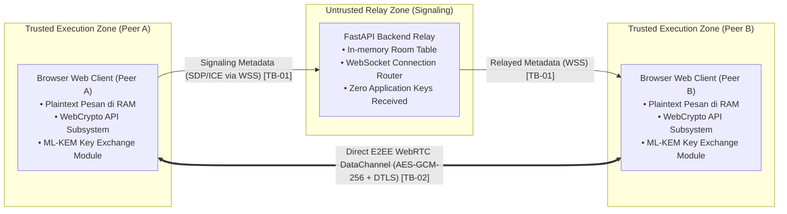
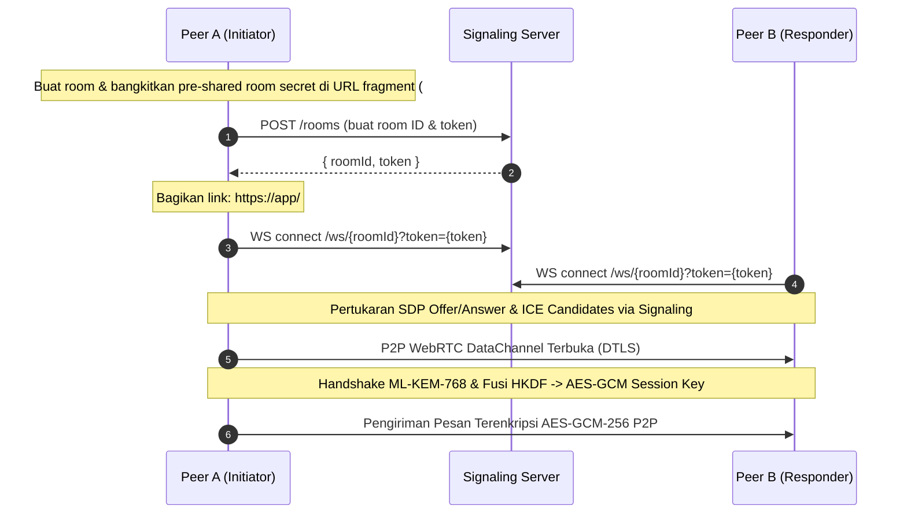

# Konteks Sistem, Batasan Kepercayaan, & Ruang Lingkup — Kiw Kiw Chat

Dokumen ini mendefinisikan batas-batas arsitektur sistem, zona kepercayaan (*Trust Boundaries*), model interaksi, dan batasan ruang lingkup evaluasi keamanan pada **Kiw Kiw Chat** (Prototipe Riset).

---

## 1. Diagram Batasan Kepercayaan (Trust Boundaries)

Sistem membagi arsitektur komunikasi ke dalam dua zona kepercayaan utama:

### Definisi Batasan Kepercayaan:
1. **TB-01 (Client-to-Signaling Boundary)**: Saluran komunikasi antara browser klien dan server backend FastAPI via WebSocket aman (WSS). Backend berfungsi sebagai *Signaling Relay* yang tidak menerima material kunci aplikasi dalam alur normal.
2. **TB-02 (Peer-to-Peer Direct Boundary)**: Saluran data langsung antar browser melalui WebRTC DataChannel yang diproteksi ganda (DTLS transport-layer security + AES-GCM-256 application-layer encryption).

---

## 2. Model Interaksi Komponen

---

## 3. Asumsi Lingkungan & Batasan Ruang Lingkup (Scope & Assumptions)

### Asumsi Keamanan (*Security Assumptions*):
1. **Integritas Browser & Endpoint**: Sistem mengasumsikan perangkat pengguna (OS dan browser) bebas dari malware aktif, keylogger, atau ekstensi jahat yang dapat membaca memori proses browser secara langsung.
2. **Kanal Pengiriman Tautan Aman**: Pengguna bertanggung jawab membagikan tautan undangan beserta fragment `#` melalui kanal komunikasi terpercaya. Pihak mana pun yang memperoleh tautan lengkap beserta fragment `#` dapat memperoleh pre-shared room secret.
3. **Penyedia Hosting & CDN**: Server backend di-hosting pada PaaS (Render) dan frontend di-distribusikan via CDN (Vercel) dengan asumsi transmisi TLS terpercaya.

### Batasan Eksplisit Ruang Lingkup (*Out of Scope & Limitations*):
- **Prototipe Riset**: Kiw Kiw Chat dievaluasi sebagai **prototipe riset akademik** dan **belum dievaluasi sebagai sistem siap produksi (*Not Evaluated as Production-Ready*)**.
- **Ketiadaan Autentikasi Identitas (*No Identity Authentication*)**: Protokol menyediakan konfirmasi kunci timbal balik (*mutual key confirmation*), bukan autentikasi identitas pihak pengguna (*identity authentication*) seperti PKI atau sertifikat digital X.509.
- **Ketiadaan Ratchet Forward Secrecy / Post-Compromise Security**: Kunci sesi berlaku selama masa hidup room (maksimal 15 menit) dan tidak menerapkan *Double Ratchet* per-pesan.
- **Batasan Secure Zeroization pada JavaScript**: Meskipun referensi memori dihapus (`delete`), engine runtime JavaScript (V8) mengelola memori via Garbage Collection dan tidak menjamin *deterministic physical RAM zeroization*.
- **Target Perangkat Komputasi**: Dioptimalkan dan diuji untuk browser desktop/laptop modern (Chromium/Firefox) dan **tidak ditargetkan untuk perangkat embedded, legacy smartphones, atau IoT berdaya sangat rendah**.
- **Sertifikasi Kriptografi Library**: Parameter ML-KEM-768 mengikuti spesifikasi NIST FIPS 203; library JavaScript pihak ketiga `mlkem` yang digunakan **tidak diklaim memiliki sertifikasi NIST CMVP**.
