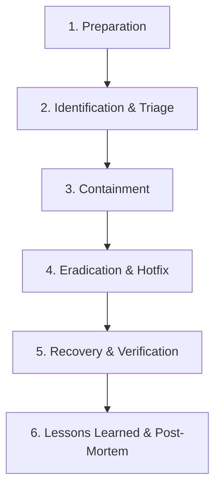

# Rencana Tanggap Insiden & Penanganan Kerentanan (Vulnerability Response & Incident Plan) — Kiw Kiw Chat

Dokumen ini mendefinisikan prosedur operasional standar (*Standard Operating Procedure* - SOP) untuk fase **Response** pada Microsoft SDL, mencakup penanganan insiden keamanan, mitigasi kerentanan kritis, dan alur rilis perbaikan darurat (*Emergency Hotfix*) pada **Kiw Kiw Chat** (Prototipe Riset).

---

## 1. Siklus Hidup Penanganan Insiden Keamanan (Incident Response Lifecycle)

---

## 2. Prosedur Operasional Berdasarkan Skenario Insiden

### Skenario A: Kebocoran Link Undangan / Room Secret oleh Pengguna
1. **Identifikasi**: Pengguna melaporkan bahwa link room terbagikan ke grup publik atau kanal tidak aman.
2. **Konten / Mitigasi Segera**:
   - Pengguna cukup menekan tombol `[ HAPUS ROOM ]` pada UI untuk memusnahkan room seketika.
   - Jika pengguna menutup tab tanpa menekan tombol, sistem server secara otomatis memusnahkan room dan memutuskan seluruh soket saat batas TTL 15 menit (900 detik) tercapai.
3. **Eradikasi**: Pre-shared room secret lama hangus permanen; room ID tidak dapat digunakan kembali.

---

### Skenario B: Kompromi atau Serangan DoS pada Server Signaling Backend
1. **Identifikasi**: Lonjakan trafik abnormal pada `POST /rooms` atau koneksi WebSocket gantung melebihi kapasitas memori server.
2. **Konten / Mitigasi Segera**:
   - Aktifkan Cloudflare Under Attack mode / rate limiting di layer edge.
   - Lakukan restart container FastAPI pada PaaS (Render).
   - Karena server beroperasi sebagai signaling relay yang tidak menerima material kunci aplikasi dalam alur normal, penyerang yang menyusup ke server **tidak dapat mendekripsi percakapan P2P** yang sedang berjalan pada WebRTC DataChannel.
3. **Eradikasi**: Perketat konfigurasi rate limiting `SlowAPI` dan periksa log request untuk memblokir rentang IP penyerang.

---

### Skenario C: Penemuan Kerentanan Kriptografi Zero-Day (misal pada library `mlkem`)
1. **Identifikasi**: Notifikasi advisory keamanan dari NIST atau pengembang library `mlkem` mengenai kelemahan implementasi lattice.
2. **Alur Perbaikan Darurat (Emergency Hotfix Flow)**:
   - Buat branch darurat `hotfix/crypto-patch`.
   - Update dependensi `mlkem` ke versi rilis perbaikan pada `package.json` dan jalankan `npm update mlkem`.
   - Eksekusi test harness lokal `python test_impkrip_final.py --runs 3` untuk memvalidasi kompatibilitas dan integritas fungsi enkapsulasi/dekapsulasi.
   - Deploy build baru ke Vercel CDN dalam waktu $< 1$ jam.
3. **Post-Mortem**: Publikasikan transparansi advisory pada halaman rilis GitHub.

---

## 3. Kebijakan Pengungkapan Kerentanan Terkoordinasi (Coordinated Vulnerability Disclosure - CVD)

- **Kanal Pelaporan**: Peneliti keamanan dapat mengirimkan laporan temuan kerentanan melalui *GitHub Security Advisories* (fitur Private Vulnerability Reporting).
- **SLA Respons**:
  - Konfirmasi penerimaan laporan awal: $\le 24$ jam.
  - Penilaian keparahan & reproduksi: $\le 72$ jam.
  - Perilisan patch perbaikan: $\le 7$ hari kalender untuk kerentanan berkategori High/Critical.
